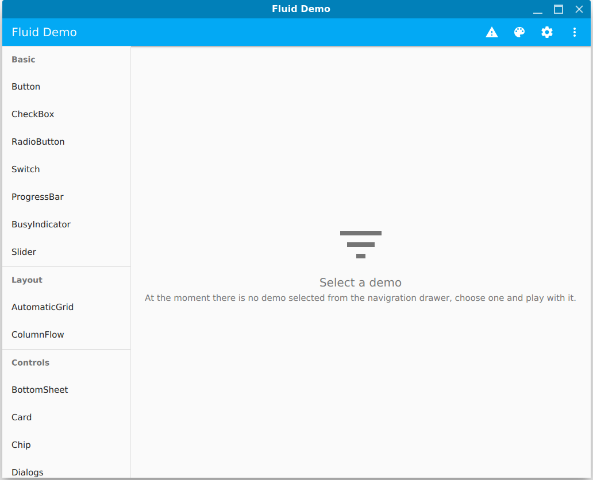

Fluid
=====

[](https://zenhub.io)

[](https://www.mozilla.org/en-US/MPL/2.0/)
[](https://github.com/lirios/fluid)
[](https://travis-ci.org/lirios/fluid)
[](https://github.com/lirios/fluid/issues)
[](https://github.com/lirios/fluid/commits/develop)

Fluid is a collection of cross-platform QtQuick components for building fluid and dynamic applications.



## Dependencies

Qt >= 5.8.0 with at least the following modules is required:

 * [qtbase](http://code.qt.io/cgit/qt/qtbase.git)
 * [qtdeclarative](http://code.qt.io/cgit/qt/qtdeclarative.git)
 * [qtquickcontrols2](http://code.qt.io/cgit/qt/qtquickcontrols2.git)
 * [qtgraphicaleffects](http://code.qt.io/cgit/qt/qtgraphicaleffects.git)
 * [qtsvg](http://code.qt.io/cgit/qt/qtsvg.git)

## Build

Qbs is a new build system that is much easier to use compared to qmake or CMake.

If you want to learn more, please read the [Qbs manual](http://doc.qt.io/qbs/index.html),
especially the [setup guide](http://doc.qt.io/qbs/configuring.html) and how to install artifacts
from the [installation guide](http://doc.qt.io/qbs/installing-files.html).

Open up `fluid.qbs` with QtCreator, hit build and run to see the demo in action.

Alternatively you can build it yourself from the terminal.
We strongly advise against manual builds, unless you have previous experience.

From the root of the repository, run:

```sh
git submodule update --init --recursive
qbs setup-toolchains --type gcc /usr/bin/g++ gcc
qbs setup-qt /usr/bin/qmake-qt5 qt5
qbs config profiles.qt5.baseProfile gcc
qbs -d build profile:qt5
```

You can also specify the following options:

 * `project.withDemo:false`: Do not build the demo app.
 * `project.withDocumentation:false`: Do not build the documentation.

Run the demo with (unless `project.withDemo:false`):

```sh
qbs run --no-build -d build --products fluid-demo
```

## System-wide installation

### Build with QMake

This will be the only build system in the next version, so you are encouraged
to test it and report any issue.

From the root of the repository, run:

```sh
mkdir build; cd build
qmake ../fluid.pro
make
make install # use sudo if necessary
```

On the `qmake` line, you can specify additional configuration parameters:

 * `LIRI_INSTALL_PREFIX=/path/to/install` (for example `/opt/liri` or `/usr`)
 * `CONFIG+=debug` if you want a debug build
 * `CONFIG+=install_under_qt` to install plugins and QML modules inside Qt

Use `make distclean` from inside your `build` directory to clean up.
You need to do this before rerunning `qmake` with different options.

### Notes on installation

A system-wide installation with `LIRI_INSTALL_PREFIX=/usr` is usually performed
by Linux distro packages.

In order to avoid potential conflicts we recommend installing under `/opt/liri`,
but this requires setting some environment variables up.

First build and install:

```sh
mkdir build; cd build
qmake LIRI_INSTALL_PREFIX=/opt/liri ../fluid.pro
make
sudo make install
```

Then create a file with the environment variables as `~/lenv` with the following contents:

```sh
LIRIDIR=/opt/liri

export LD_LIBRARY_PATH=$LIRIDIR/lib:$LD_LIBRARY_PATH
export XDG_DATA_DIRS=$LIRIDIR/share:/usr/local/share:/usr/share:~/.local/share:~/.local/share/flatpak/exports/share
export XDG_CONFIG_DIRS=$LIRIDIR/etc/xdg:/etc/xdg
export QT_PLUGIN_PATH=$LIRIDIR/lib/plugins
export QML2_IMPORT_PATH=$LIRIDIR/lib/qml:$QML2_IMPORT_PATH
export PATH=$LIRIDIR/bin:$PATH
```

Source the file (we are assuming a bash shell here):

```sh
source ~/lenv
```

And run `fluid-demo` to test:

```sh
fluid-demo
```

## Per-project installation using QMake

You can embed Fluid in your project and build it along your app.

First, clone this repository.

In your project file, include the `fluid.pri` file:  
```qmake
include(path/to/fluid.pri)
```

Then, in your `main.cpp` file or wherever you set up a `QQmlApplicationEngine`:
* add this include directive:
```cpp
#include "iconsimageprovider.h"
#include "iconthemeimageprovider.h"
```
* add the resources files to your `QQmlApplicationEngine` import paths:
```cpp
engine.addImportPath(QLatin1String("qrc:/"));
```
* register fluid's image providers to the engine:
```cpp
engine.addImageProvider(QLatin1String("fluidicons"), new IconsImageProvider());
engine.addImageProvider(QLatin1String("fluidicontheme"), new IconThemeImageProvider());
```
* and after that you can load your qml file:  
```cpp
engine.load(QUrl(QLatin1String("qrc:/main.qml")));
```

## Documentation

Build the HTML documentation from the `build` directory created earlied:

```sh
cd build
make html_docs_fluid
```

Then open up `doc/fluid/html/index.html` with a browser.

## Licensing

Licensed under the terms of the Mozilla Public License version 2.0.
